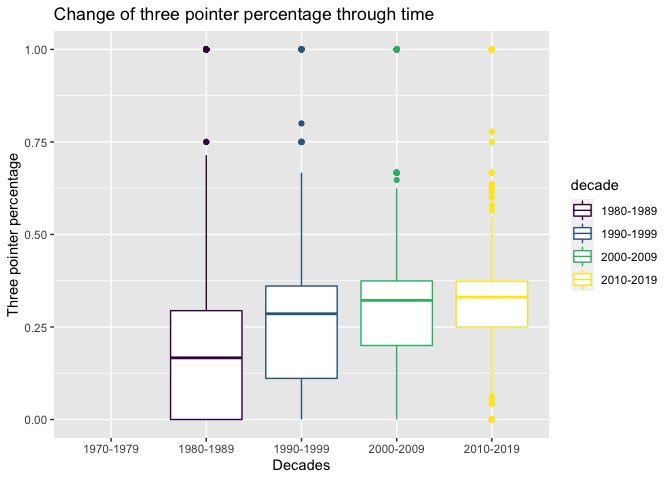

nba\_analysis
================

## Authors: Roshan Verma, Ben Pilon, Kaiming Xia, Shiloh Xu

### Stat 240 Final Project Fall 2020. Discussion Group 5

### **Introduction**

The National Basketball Association has been a pillar of popculture over
the last 40 years. Icons like Michael Jordan, Kobe Bryant, Lebron James,
and Steph Curry have been some of the most popular figures in sports
over the past few decades. The 3 point revolution, led by Curry, has
changed the game over the last 10 years, with there being more shooting
now than ever before, and more guards dominating the game than in years
past. We were interested in using the data to explore these changes more
in depth, and understanding the modern composition of the NBA. We
believe that the NBA has changed substantially over the last 10 years,
both in terms of style of play and an emphasis on a smaller, shooting
line up, as well as in terms of talent, both internationally and from a
diverse range of colleges among the United States. Throughout this
Report, our analysis will center on answering the question

> ***How has the league changed in the last 50 years, both
> demographically and in terms of how it is played? We believe the
> league has changed substantially in terms of composition and style of
> play. ***

### **Background**

The data used in this report consists of 3 datasets. The first data set
is basic box stats(points, rebounds, assists, games played, minutes, 3
point attempts 2 point attempts,…etc) as well as more advanced
stats(Like effective field goal percentage, true shooting percentage,
player efficiency rating, …etc). The second and third datasets contain
data regarding players backgrounds such as, birth city, birthdate, birth
country, college, and age. The data in this datasets were collected by
the NBA and recorded on <https://www.basketball-reference.com/> before a
Kaggle user named Omri Goldstien created the datasets and posted them to
Kaggle.com.

The variables used in this data set are player age, total season points,
total season assists, total season rebounds, birth state/country,
season, college, total games in a season, total season field goals,
total season made field goals, total season 3 point attempts, total
season 3 point makes,season 3 point percentage, total season 2 point
attempts, total season 2 point makes, season 2 point percentage, height,
weight, and effective field goal percentage. Below is a description of
each variable.

**player name**- Name of the player

**player age**- age of the player in that season

**total season points**- total points scored by a player in the season

**total season assists**- total assists by a player in the season

**total season rebounds**- total rebounds by a player in the season

**birth state/country**- what us state or country the player was born in

**season**- which nba season the data are from

**college**- which college (if any) the player attended before playing
in the NBA

**total games in a season** - total games a player played in a season

**total season field goals** -total field goals(shots) a player took in
a season

**total season made field goals**- total field goals(shots) a player
made in a season

**total season 3 point attempts**- total 3 point shots a player took in
a season

**total season 3 point makes**- total 3 point shots a player made in a
season

**season 3 point percentage**- percent of 3 point makes for a player in
a season

**total season 2 point attempts**- total 2 point shots a player took in
a season

**total season 2 point makes**- total 2 point shots a player made in a
season

**season 2 point percentage**- percent of 2 point makes for a player in
a season

**height**- player’s height in cm for that season

**weight**- player’s weight in cm for that season

**effective field goal percentage**- a weighted percentage given that
some shots (3 pointers) are worth more than others.

Originally, the data did not contain any information regarding 3 point
shooting, however because we had field goal data and 2 pointer data we
could find the 3 point data. Field Goals Attempts is the total of 3
point attempts and 2 point attempts so subtracting 2 point attempts
yields 3 point attempts, a similar system was used to calculate the
other 3 point data used.

## Source of Data

-   <https://www.kaggle.com/drgilermo/nba-players-stats?select=Seasons_Stats.csv>
-   Compiled in: 2018
-   By: Omri Goldstien
-   From this link, the files we used are *player\_data.csv*,
    *Seasons\_Stats.csv*, *Players.csv*

The story line in the NBA since the 2015 Warriors won the championship
has been that the game of basketball has become based around high volume
of accurate 3 point shots, shorter, faster players, and ball movement
(assists). We are seeking to see if this story is true and what other
changes in the league may changed.

Without knowing the history of the league our data and our
interpretations might seem confusing. The league is regularly changing
rules which inevitable impact how players play, the largest of these
changes is the addition of the three point line in 1986, before this
every shot was only worth 2 points. Another factor which effects our
data is player injuries, and playing time. Players can put up amazing
stats for half of a season but due to an injury appear as a below
average player for that season. FInally, when this data was recorded the
2010-2019 decade had not yet finished so the data only goes up until
2017.

The first 3 questions of this report look into how the type of player in
the league has changed, by looking at the age of the player and how that
effects their playing, then this report examines how the league has
changed in regard to player origin, both by looking at the country they
come from and the college they went to. The final () questions of this
report look at changes in how the game is played, starting with an
examination of changing shot selections, then investigating how
rebounding and height have changed in the league, before finally looking
at assists and ball movement.

### 1) How does a players age change their overall impact on a game in terms of games played, points scored, rebounds grabbed, and assists given, has this changed over time?

> > For these questions we wanted to examine how the performance of
> > different age groups has changed throughout time. We did this by
> > plotting box charts for each age group in every decade to see how
> > players from the same age groups preformed across time. We used
> > boxcharts so as to best compare the distribution of performances in
> > by players.

<table class="gt_table">
<thead class="gt_header">
<tr>
<th colspan="2" class="gt_heading gt_title gt_font_normal" style>
Number of players under 20
</th>
</tr>
<tr>
<th colspan="2" class="gt_heading gt_subtitle gt_font_normal gt_bottom_border" style>
</th>
</tr>
</thead>
<thead class="gt_col_headings">
<tr>
<th class="gt_col_heading gt_columns_bottom_border gt_center" rowspan="1" colspan="1">
decade
</th>
<th class="gt_col_heading gt_columns_bottom_border gt_center" rowspan="1" colspan="1">
number of players
</th>
</tr>
</thead>
<tbody class="gt_table_body">
<tr>
<td class="gt_row gt_center">
1970-1979
</td>
<td class="gt_row gt_center">
3
</td>
</tr>
<tr>
<td class="gt_row gt_center">
1980-1989
</td>
<td class="gt_row gt_center">
1
</td>
</tr>
<tr>
<td class="gt_row gt_center">
1990-1999
</td>
<td class="gt_row gt_center">
11
</td>
</tr>
<tr>
<td class="gt_row gt_center">
2000-2009
</td>
<td class="gt_row gt_center">
50
</td>
</tr>
<tr>
<td class="gt_row gt_center">
2010-2019
</td>
<td class="gt_row gt_center">
41
</td>
</tr>
</tbody>
</table>

<table class="gt_table">
<thead class="gt_header">
<tr>
<th colspan="2" class="gt_heading gt_title gt_font_normal" style>
Number of players age 20-24
</th>
</tr>
<tr>
<th colspan="2" class="gt_heading gt_subtitle gt_font_normal gt_bottom_border" style>
</th>
</tr>
</thead>
<thead class="gt_col_headings">
<tr>
<th class="gt_col_heading gt_columns_bottom_border gt_center" rowspan="1" colspan="1">
decade
</th>
<th class="gt_col_heading gt_columns_bottom_border gt_center" rowspan="1" colspan="1">
number of players
</th>
</tr>
</thead>
<tbody class="gt_table_body">
<tr>
<td class="gt_row gt_center">
1970-1979
</td>
<td class="gt_row gt_center">
443
</td>
</tr>
<tr>
<td class="gt_row gt_center">
1980-1989
</td>
<td class="gt_row gt_center">
1180
</td>
</tr>
<tr>
<td class="gt_row gt_center">
1990-1999
</td>
<td class="gt_row gt_center">
1181
</td>
</tr>
<tr>
<td class="gt_row gt_center">
2000-2009
</td>
<td class="gt_row gt_center">
1438
</td>
</tr>
<tr>
<td class="gt_row gt_center">
2010-2019
</td>
<td class="gt_row gt_center">
1438
</td>
</tr>
</tbody>
</table>

<table class="gt_table">
<thead class="gt_header">
<tr>
<th colspan="2" class="gt_heading gt_title gt_font_normal" style>
Number of players age 25-29
</th>
</tr>
<tr>
<th colspan="2" class="gt_heading gt_subtitle gt_font_normal gt_bottom_border" style>
</th>
</tr>
</thead>
<thead class="gt_col_headings">
<tr>
<th class="gt_col_heading gt_columns_bottom_border gt_center" rowspan="1" colspan="1">
decade
</th>
<th class="gt_col_heading gt_columns_bottom_border gt_center" rowspan="1" colspan="1">
number of players
</th>
</tr>
</thead>
<tbody class="gt_table_body">
<tr>
<td class="gt_row gt_center">
1970-1979
</td>
<td class="gt_row gt_center">
585
</td>
</tr>
<tr>
<td class="gt_row gt_center">
1980-1989
</td>
<td class="gt_row gt_center">
1585
</td>
</tr>
<tr>
<td class="gt_row gt_center">
1990-1999
</td>
<td class="gt_row gt_center">
1820
</td>
</tr>
<tr>
<td class="gt_row gt_center">
2000-2009
</td>
<td class="gt_row gt_center">
1814
</td>
</tr>
<tr>
<td class="gt_row gt_center">
2010-2019
</td>
<td class="gt_row gt_center">
1634
</td>
</tr>
</tbody>
</table>

<table class="gt_table">
<thead class="gt_header">
<tr>
<th colspan="2" class="gt_heading gt_title gt_font_normal" style>
Number of players age 30-34
</th>
</tr>
<tr>
<th colspan="2" class="gt_heading gt_subtitle gt_font_normal gt_bottom_border" style>
</th>
</tr>
</thead>
<thead class="gt_col_headings">
<tr>
<th class="gt_col_heading gt_columns_bottom_border gt_center" rowspan="1" colspan="1">
decade
</th>
<th class="gt_col_heading gt_columns_bottom_border gt_center" rowspan="1" colspan="1">
number of players
</th>
</tr>
</thead>
<tbody class="gt_table_body">
<tr>
<td class="gt_row gt_center">
1970-1979
</td>
<td class="gt_row gt_center">
193
</td>
</tr>
<tr>
<td class="gt_row gt_center">
1980-1989
</td>
<td class="gt_row gt_center">
586
</td>
</tr>
<tr>
<td class="gt_row gt_center">
1990-1999
</td>
<td class="gt_row gt_center">
994
</td>
</tr>
<tr>
<td class="gt_row gt_center">
2000-2009
</td>
<td class="gt_row gt_center">
1156
</td>
</tr>
<tr>
<td class="gt_row gt_center">
2010-2019
</td>
<td class="gt_row gt_center">
837
</td>
</tr>
</tbody>
</table>

<table class="gt_table">
<thead class="gt_header">
<tr>
<th colspan="2" class="gt_heading gt_title gt_font_normal" style>
Number of players age 35-39
</th>
</tr>
<tr>
<th colspan="2" class="gt_heading gt_subtitle gt_font_normal gt_bottom_border" style>
</th>
</tr>
</thead>
<thead class="gt_col_headings">
<tr>
<th class="gt_col_heading gt_columns_bottom_border gt_center" rowspan="1" colspan="1">
decade
</th>
<th class="gt_col_heading gt_columns_bottom_border gt_center" rowspan="1" colspan="1">
number of players
</th>
</tr>
</thead>
<tbody class="gt_table_body">
<tr>
<td class="gt_row gt_center">
1970-1979
</td>
<td class="gt_row gt_center">
8
</td>
</tr>
<tr>
<td class="gt_row gt_center">
1980-1989
</td>
<td class="gt_row gt_center">
43
</td>
</tr>
<tr>
<td class="gt_row gt_center">
1990-1999
</td>
<td class="gt_row gt_center">
179
</td>
</tr>
<tr>
<td class="gt_row gt_center">
2000-2009
</td>
<td class="gt_row gt_center">
282
</td>
</tr>
<tr>
<td class="gt_row gt_center">
2010-2019
</td>
<td class="gt_row gt_center">
212
</td>
</tr>
</tbody>
</table>

<table class="gt_table">
<thead class="gt_header">
<tr>
<th colspan="2" class="gt_heading gt_title gt_font_normal" style>
Number of players age 40 or older
</th>
</tr>
<tr>
<th colspan="2" class="gt_heading gt_subtitle gt_font_normal gt_bottom_border" style>
</th>
</tr>
</thead>
<thead class="gt_col_headings">
<tr>
<th class="gt_col_heading gt_columns_bottom_border gt_center" rowspan="1" colspan="1">
decade
</th>
<th class="gt_col_heading gt_columns_bottom_border gt_center" rowspan="1" colspan="1">
number of players
</th>
</tr>
</thead>
<tbody class="gt_table_body">
<tr>
<td class="gt_row gt_center">
1980-1989
</td>
<td class="gt_row gt_center">
2
</td>
</tr>
<tr>
<td class="gt_row gt_center">
1990-1999
</td>
<td class="gt_row gt_center">
8
</td>
</tr>
<tr>
<td class="gt_row gt_center">
2000-2009
</td>
<td class="gt_row gt_center">
8
</td>
</tr>
<tr>
<td class="gt_row gt_center">
2010-2019
</td>
<td class="gt_row gt_center">
3
</td>
</tr>
</tbody>
</table>

<!--/html_preserve-->

<!-- --><!-- -->

Older players today are clearly much worse than older players several
decades ago in the points category, especially when looking at younger
players who have today have a much more predicable season point
production than in previous decades.

<!-- --><!-- -->

When looking at assists the difference is much less pronounced, older
players are still able to impact the game through their ability to pass
the ball. However, when looking at the data it also looks like passing
ability has become a much more universal skill, hence the more squished
boxes in the recent decades meaning that players whose main contribution
is passing are much less likely to standout about the rest of the
league.

<!-- --><!-- -->

Interestingly, older players and younger players both seem to have seen
a decline in rebounding ability in this decade, which could be due to
other changes in how the game was played making rebounding less valuable
to team strategy and/or rebounds being less available.

### 2a) How has the composition of the league regarding origin of players changed over the selected period (1976-2017)

> > Every player was sorted into a category based on whether their
> > school was one of the 10 most winning programs in US college
> > basketball. Then these players’ performances were plotted and the
> > regression graphed for each of the group.

One of the major changes the NBA has seen over the years is its
development into an international sport. Many countries have their own
basketball leagues and the NBA has seen a rise in its own numbers of
international players. 

<table class="gt_table">
<thead class="gt_header">
<tr>
<th colspan="8" class="gt_heading gt_title gt_font_normal" style>
Where players are coming from: By Decade
</th>
</tr>
<tr>
<th colspan="8" class="gt_heading gt_subtitle gt_font_normal gt_bottom_border" style>
</th>
</tr>
</thead>
<thead class="gt_col_headings">
<tr>
<th class="gt_col_heading gt_columns_bottom_border gt_left" rowspan="1" colspan="1">
nationality
</th>
<th class="gt_col_heading gt_columns_bottom_border gt_center" rowspan="1" colspan="1">
1950-1959
</th>
<th class="gt_col_heading gt_columns_bottom_border gt_center" rowspan="1" colspan="1">
1960-1969
</th>
<th class="gt_col_heading gt_columns_bottom_border gt_center" rowspan="1" colspan="1">
1970-1979
</th>
<th class="gt_col_heading gt_columns_bottom_border gt_center" rowspan="1" colspan="1">
1980-1989
</th>
<th class="gt_col_heading gt_columns_bottom_border gt_center" rowspan="1" colspan="1">
1990-1999
</th>
<th class="gt_col_heading gt_columns_bottom_border gt_center" rowspan="1" colspan="1">
2000-2009
</th>
<th class="gt_col_heading gt_columns_bottom_border gt_center" rowspan="1" colspan="1">
2010-2019
</th>
</tr>
</thead>
<tbody class="gt_table_body">
<tr>
<td class="gt_row gt_left">
international
</td>
<td class="gt_row gt_center">
2
</td>
<td class="gt_row gt_center">
1
</td>
<td class="gt_row gt_center">
7
</td>
<td class="gt_row gt_center">
30
</td>
<td class="gt_row gt_center">
30
</td>
<td class="gt_row gt_center">
50
</td>
<td class="gt_row gt_center">
51
</td>
</tr>
<tr>
<td class="gt_row gt_left">
US
</td>
<td class="gt_row gt_center">
159
</td>
<td class="gt_row gt_center">
190
</td>
<td class="gt_row gt_center">
423
</td>
<td class="gt_row gt_center">
572
</td>
<td class="gt_row gt_center">
594
</td>
<td class="gt_row gt_center">
486
</td>
<td class="gt_row gt_center">
445
</td>
</tr>
</tbody>
</table>

<!--/html_preserve-->

<!-- -->

The graphical visualization of this change is interesting because there
is clearly a large drop in the number of players in the league in total
while the number of international players seems to be slowly increasing.

### 2B) It is common knowlege that there are certain elite colleges who are the best at creating NBA level talent. If the competition for a NBA team roster is fiercer as indicated above, we would expect to see the largest differece between performance of players from Elite colleges and Non-Elite colleges in more recent decades.

<!-- -->

# 2C) A regression analysis of school program affects scoring averages in the NBA

*H*0: *β*elite = *β*other  
*H**A*: *β*elite ≠ *β*other

<table class="gt_table">
<thead class="gt_col_headings">
<tr>
<th class="gt_col_heading gt_columns_bottom_border gt_left" rowspan="1" colspan="1">
decade
</th>
<th class="gt_col_heading gt_columns_bottom_border gt_right" rowspan="1" colspan="1">
se
</th>
<th class="gt_col_heading gt_columns_bottom_border gt_right" rowspan="1" colspan="1">
est
</th>
<th class="gt_col_heading gt_columns_bottom_border gt_right" rowspan="1" colspan="1">
tstat
</th>
<th class="gt_col_heading gt_columns_bottom_border gt_center" rowspan="1" colspan="1">
df
</th>
<th class="gt_col_heading gt_columns_bottom_border gt_right" rowspan="1" colspan="1">
p\_value
</th>
</tr>
</thead>
<tbody class="gt_table_body">
<tr>
<td class="gt_row gt_left">
1970-1979
</td>
<td class="gt_row gt_right">
0.03298755
</td>
<td class="gt_row gt_right">
0.005854540
</td>
<td class="gt_row gt_right">
0.1774772
</td>
<td class="gt_row gt_center">
748
</td>
<td class="gt_row gt_right">
0.8591816
</td>
</tr>
<tr>
<td class="gt_row gt_left">
1980-1989
</td>
<td class="gt_row gt_right">
0.02861135
</td>
<td class="gt_row gt_right">
-0.014726968
</td>
<td class="gt_row gt_right">
-0.5147247
</td>
<td class="gt_row gt_center">
1390
</td>
<td class="gt_row gt_right">
0.6068273
</td>
</tr>
<tr>
<td class="gt_row gt_left">
1990-1999
</td>
<td class="gt_row gt_right">
0.03468081
</td>
<td class="gt_row gt_right">
0.018759172
</td>
<td class="gt_row gt_right">
0.5409093
</td>
<td class="gt_row gt_center">
1574
</td>
<td class="gt_row gt_right">
0.5886466
</td>
</tr>
<tr>
<td class="gt_row gt_left">
2000-2009
</td>
<td class="gt_row gt_right">
0.02734783
</td>
<td class="gt_row gt_right">
0.005838253
</td>
<td class="gt_row gt_right">
0.2134814
</td>
<td class="gt_row gt_center">
1582
</td>
<td class="gt_row gt_right">
0.8309790
</td>
</tr>
<tr>
<td class="gt_row gt_left">
2010-2019
</td>
<td class="gt_row gt_right">
0.02610311
</td>
<td class="gt_row gt_right">
-0.010278471
</td>
<td class="gt_row gt_right">
-0.3937642
</td>
<td class="gt_row gt_center">
1388
</td>
<td class="gt_row gt_right">
0.6938156
</td>
</tr>
</tbody>
</table>

<!--/html_preserve-->

    ## [[1]]

<!-- -->

    ## 
    ## [[2]]

<!-- -->

    ## 
    ## [[3]]

<!-- -->

    ## 
    ## [[4]]

<!-- -->

    ## 
    ## [[5]]

<!-- -->

It is not reasonable to combine the Elite programs and the non elite
programs to estimate a common slope for a regression line that models
Average points per game vs The number of games played in a season.
Although at first glance the plots may appear to have similar lines, the
hypohtesis test finds a discernible difference in the estimated slopes
for the data collected for the two program types. These are both
reasonable indicators for a player’s success in a given decade because
not only does scoring in an NBA game matter, but the number one asset to
a player is their longevity.

### 3) Has shot selection actually changed, or is this merely a myth related to the dominance of current players like Steph Curry and James Harden

> > To best look at this question, first 3 point data had to be
> > computed. This was done by subtracting 2 point data from field goal
> > data. Once three point data was computed it needed to be compared to
> > total field goals and two point shots in each decade. This was done
> > using barchart first showing totals of all three categories and
> > second showing two pointers and three pointers as a percentage of
> > total field goals.

<!-- --><!-- -->

3 point shooting has grown both as a percentage of total shots and as in
the total number of 3 point shots taken. The final decade is only
partial but it seems like the total number of shots in general is also
increasing over time, which paired with the fact that the percent of
shots that are 2 pointers is decreasing suggests that many of these
“new” shots are 3 point shots.

### 4a) Analyzing changes in total rebounds in different eras.

<!-- --><!-- -->

TRB is defined as *The total number of rebounds grabbed in a season*

This analysis here shows two separate graphs, one graphing
`rebounds vs weight` and another graphing `rebounds vs rebounds`

The Blue points are for players before 2010. The Red points are for
players after 2010. The green lines indicate the average for both
groups. As the graph shows us, The blue players (players before 2010),
have a much higher appearance rate above the green lines than the red
players, much more often than the red data points. The green lines in
both indicate the average weight and height respectively, while the
purple line in both show the average total rebounds between the data for
players before 2010 and after.

We back this visual analysis up with a numerical analysis as well:

-   The average height back before 2010 was: 199.7950562 centimeters
-   The average height in and after 2010 was: 200.236792 centimeters
-   The average weight back before 2010 was: 211.9040257 pounds
-   The average weight in and after 2010 was: 220.4121847 pounds
-   The average number of total rebounds before 2010 was: 229.9295936
    rebounds/season
-   The average trb in and after 2010 was : 212.9790576 rebounds/season

The heights between the two eras is almost identical, with a difference
of only: 0.2210944%

The weights between the two era actually increased, by 4.0151002%

This is an interesting find. Typically, you would expect that if players
are getting both taller and heavier (presumably through added muscle
mass), then getting rebounds, which is one of the most physical parts of
the game, and thus tends to favor larger set players, would also
increase. To ensure equal data, it is important to note that both
datasets contain roughly the same number of data points (\~8500), and
thus the averages cannot be skewed simply based off of sheer volume.

This however, is not the trend, as the TRB between the two eras dropped
significantly, by -7.372055%. We can see the same trend visually, as the
graphs here show.

Before 2010, the red points, appear much more above the average total
rebounds weight, indicating that before 2010, heavier set players tended
to grab more rebounds. When it comes to height however, the data seems
to be much more even.

We further explore the reasoning for why size may not matter as much in
rebounding in the new era, and why rebounding as a whole has decreased.

# 4b) Looking at effective Field Goal percentage

<table class="gt_table">
<thead class="gt_col_headings">
<tr>
<th class="gt_col_heading gt_columns_bottom_border gt_right" rowspan="1" colspan="1">
1976
</th>
<th class="gt_col_heading gt_columns_bottom_border gt_right" rowspan="1" colspan="1">
1977
</th>
<th class="gt_col_heading gt_columns_bottom_border gt_right" rowspan="1" colspan="1">
1978
</th>
<th class="gt_col_heading gt_columns_bottom_border gt_right" rowspan="1" colspan="1">
1979
</th>
<th class="gt_col_heading gt_columns_bottom_border gt_right" rowspan="1" colspan="1">
1980
</th>
<th class="gt_col_heading gt_columns_bottom_border gt_right" rowspan="1" colspan="1">
1981
</th>
<th class="gt_col_heading gt_columns_bottom_border gt_right" rowspan="1" colspan="1">
1982
</th>
<th class="gt_col_heading gt_columns_bottom_border gt_right" rowspan="1" colspan="1">
1983
</th>
<th class="gt_col_heading gt_columns_bottom_border gt_right" rowspan="1" colspan="1">
1984
</th>
<th class="gt_col_heading gt_columns_bottom_border gt_right" rowspan="1" colspan="1">
1985
</th>
</tr>
</thead>
<tbody class="gt_table_body">
<tr>
<td class="gt_row gt_right">
0.4463373
</td>
<td class="gt_row gt_right">
0.4537554
</td>
<td class="gt_row gt_right">
0.4527946
</td>
<td class="gt_row gt_right">
0.4682776
</td>
<td class="gt_row gt_right">
0.4722661
</td>
<td class="gt_row gt_right">
0.46684
</td>
<td class="gt_row gt_right">
0.4781163
</td>
<td class="gt_row gt_right">
0.4714633
</td>
<td class="gt_row gt_right">
0.4785081
</td>
<td class="gt_row gt_right">
0.4839432
</td>
</tr>
</tbody>
</table>

<table class="gt_table">
<thead class="gt_col_headings">
<tr>
<th class="gt_col_heading gt_columns_bottom_border gt_right" rowspan="1" colspan="1">
2017
</th>
<th class="gt_col_heading gt_columns_bottom_border gt_right" rowspan="1" colspan="1">
2016
</th>
<th class="gt_col_heading gt_columns_bottom_border gt_right" rowspan="1" colspan="1">
2015
</th>
<th class="gt_col_heading gt_columns_bottom_border gt_right" rowspan="1" colspan="1">
2014
</th>
<th class="gt_col_heading gt_columns_bottom_border gt_right" rowspan="1" colspan="1">
2013
</th>
<th class="gt_col_heading gt_columns_bottom_border gt_right" rowspan="1" colspan="1">
2012
</th>
<th class="gt_col_heading gt_columns_bottom_border gt_right" rowspan="1" colspan="1">
2011
</th>
<th class="gt_col_heading gt_columns_bottom_border gt_right" rowspan="1" colspan="1">
2010
</th>
<th class="gt_col_heading gt_columns_bottom_border gt_right" rowspan="1" colspan="1">
2009
</th>
<th class="gt_col_heading gt_columns_bottom_border gt_right" rowspan="1" colspan="1">
2008
</th>
</tr>
</thead>
<tbody class="gt_table_body">
<tr>
<td class="gt_row gt_right">
0.5044521
</td>
<td class="gt_row gt_right">
0.4934754
</td>
<td class="gt_row gt_right">
0.485293
</td>
<td class="gt_row gt_right">
0.4862767
</td>
<td class="gt_row gt_right">
0.4811782
</td>
<td class="gt_row gt_right">
0.4745481
</td>
<td class="gt_row gt_right">
0.4873821
</td>
<td class="gt_row gt_right">
0.488513
</td>
<td class="gt_row gt_right">
0.4855409
</td>
<td class="gt_row gt_right">
0.4796472
</td>
</tr>
</tbody>
</table>

<!--/html_preserve-->

<!-- -->

Combining the analysis of the previous two questions we see an
interesting trend:

*eFG%* is defined as **Effective Field Goal Percentage; the formula is
(FG + 0.5 \* 3P) / FGA. This statistic adjusts for the fact that a
3-point field goal is worth one more point than a 2-point field goal.**
In other words, a more accurate representation of how often a player
scores successfully.

For numerical confirmation, we list the first 10 years of the dataset
and the last 10 years and notice the same trend.

### 5a): How has the rise in 3 Point shooting changed over the past decades?

<!-- -->

For this problem, we analyze the three point percentage for each decade
and do the a boxplot on that. The percentage of three pointers here is
defined as how many three pointers players have made. From the boxplot
above, there is a clear pattern that the percentage of three pointers
has been increased steadily over the years.

### 5b) Change of assists in terms of three point percentage over the past years?

> > For this analysis, we look at assists in terms of the number of
> > times the player assisted others. We believe that players who give
> > more assists are part of teams that have more ball movement and thus
> > higher assists overall. We also believe that players who are
> > shooting at a high volume and a high hit rate are more skilled and
> > therefore more like likely to assist others as well.

<table class="gt_table">
<thead class="gt_col_headings">
<tr>
<th class="gt_col_heading gt_columns_bottom_border gt_left" rowspan="1" colspan="1">
3 Point Hit rate
</th>
<th class="gt_col_heading gt_columns_bottom_border gt_right" rowspan="1" colspan="1">
Average Num of points
</th>
</tr>
</thead>
<tbody class="gt_table_body">
<tr>
<td class="gt_row gt_left">
0-24%
</td>
<td class="gt_row gt_right">
109.87582
</td>
</tr>
<tr>
<td class="gt_row gt_left">
25-49%
</td>
<td class="gt_row gt_right">
165.05613
</td>
</tr>
<tr>
<td class="gt_row gt_left">
50-74%
</td>
<td class="gt_row gt_right">
65.60571
</td>
</tr>
<tr>
<td class="gt_row gt_left">
75-100%
</td>
<td class="gt_row gt_right">
50.92308
</td>
</tr>
</tbody>
</table>

<!--/html_preserve-->

<!-- --><!-- -->

From the graph, players who have a three point percentage between
25%-49% have the highest number of assists than other three point
percent categories. This makes sense because the players who fit into
50-74% and 75-100% are likely to play just very few games, which makes
these two much lower on their total assists. On the contrary, players
who have three point percentage of 0-24% and 25-49% are the most common
and therefore, play many games and have higher assists rate.

### 5c) How does 3pt shot performance impacts the total number of scores for each player over the past years?

<table class="gt_table">
<thead class="gt_col_headings">
<tr>
<th class="gt_col_heading gt_columns_bottom_border gt_left" rowspan="1" colspan="1">
3 Point Hit rate
</th>
<th class="gt_col_heading gt_columns_bottom_border gt_right" rowspan="1" colspan="1">
Average Num of points/Season
</th>
</tr>
</thead>
<tbody class="gt_table_body">
<tr>
<td class="gt_row gt_left">
0-24%
</td>
<td class="gt_row gt_right">
529.6972
</td>
</tr>
<tr>
<td class="gt_row gt_left">
25-49%
</td>
<td class="gt_row gt_right">
657.7919
</td>
</tr>
<tr>
<td class="gt_row gt_left">
50-74%
</td>
<td class="gt_row gt_right">
360.1257
</td>
</tr>
<tr>
<td class="gt_row gt_left">
75-100%
</td>
<td class="gt_row gt_right">
354.0513
</td>
</tr>
</tbody>
</table>

<!--/html_preserve-->
<!-- --><!-- -->

<table class="gt_table">
<thead class="gt_header">
<tr>
<th colspan="4" class="gt_heading gt_title gt_font_normal" style>
Highest total number of threes in a single season in NBA history by a
Single Player
</th>
</tr>
<tr>
<th colspan="4" class="gt_heading gt_subtitle gt_font_normal gt_bottom_border" style>
</th>
</tr>
</thead>
<thead class="gt_col_headings">
<tr>
<th class="gt_col_heading gt_columns_bottom_border gt_center" rowspan="1" colspan="1">
Order
</th>
<th class="gt_col_heading gt_columns_bottom_border gt_right" rowspan="1" colspan="1">
Number of Threes
</th>
<th class="gt_col_heading gt_columns_bottom_border gt_right" rowspan="1" colspan="1">
Season
</th>
<th class="gt_col_heading gt_columns_bottom_border gt_left" rowspan="1" colspan="1">
Player
</th>
</tr>
</thead>
<tbody class="gt_table_body">
<tr>
<td class="gt_row gt_center">
1
</td>
<td class="gt_row gt_right">
402
</td>
<td class="gt_row gt_right">
2016
</td>
<td class="gt_row gt_left">
Stephen Curry
</td>
</tr>
<tr>
<td class="gt_row gt_center">
2
</td>
<td class="gt_row gt_right">
324
</td>
<td class="gt_row gt_right">
2017
</td>
<td class="gt_row gt_left">
Stephen Curry
</td>
</tr>
<tr>
<td class="gt_row gt_center">
3
</td>
<td class="gt_row gt_right">
286
</td>
<td class="gt_row gt_right">
2015
</td>
<td class="gt_row gt_left">
Stephen Curry
</td>
</tr>
<tr>
<td class="gt_row gt_center">
4
</td>
<td class="gt_row gt_right">
276
</td>
<td class="gt_row gt_right">
2016
</td>
<td class="gt_row gt_left">
Klay Thompson
</td>
</tr>
<tr>
<td class="gt_row gt_center">
5
</td>
<td class="gt_row gt_right">
272
</td>
<td class="gt_row gt_right">
2013
</td>
<td class="gt_row gt_left">
Stephen Curry
</td>
</tr>
<tr>
<td class="gt_row gt_center">
6
</td>
<td class="gt_row gt_right">
269
</td>
<td class="gt_row gt_right">
2006
</td>
<td class="gt_row gt_left">
Ray Allen
</td>
</tr>
<tr>
<td class="gt_row gt_center">
7
</td>
<td class="gt_row gt_right">
268
</td>
<td class="gt_row gt_right">
2017
</td>
<td class="gt_row gt_left">
Klay Thompson
</td>
</tr>
<tr>
<td class="gt_row gt_center">
8
</td>
<td class="gt_row gt_right">
267
</td>
<td class="gt_row gt_right">
1996
</td>
<td class="gt_row gt_left">
Dennis Scott
</td>
</tr>
<tr>
<td class="gt_row gt_center">
9
</td>
<td class="gt_row gt_right">
262
</td>
<td class="gt_row gt_right">
2017
</td>
<td class="gt_row gt_left">
James Harden
</td>
</tr>
<tr>
<td class="gt_row gt_center">
10
</td>
<td class="gt_row gt_right">
261
</td>
<td class="gt_row gt_right">
2014
</td>
<td class="gt_row gt_left">
Stephen Curry
</td>
</tr>
</tbody>
</table>

<!--/html_preserve-->

There is a similar pattern for the above boxplot to the previous one
which is the number of assists related to three point precentage.
Players with a three point hit rate of 25-49% have the highest average
and highest total points. Again, the explanation would be similar in
that players who have a higher three point hit rate tends to have played
fewer games than those who have a relatively lower hit rate. The pattern
is pretty consistent across decades.

## Question 6: Which Position group is the most valuable?

<table class="gt_table">
<thead class="gt_header">
<tr>
<th colspan="6" class="gt_heading gt_title gt_font_normal" style>
Average Win Shares per 48 minutes by position by decade
</th>
</tr>
<tr>
<th colspan="6" class="gt_heading gt_subtitle gt_font_normal gt_bottom_border" style>
</th>
</tr>
</thead>
<thead class="gt_col_headings">
<tr>
<th class="gt_col_heading gt_columns_bottom_border gt_center" rowspan="1" colspan="1">
decade
</th>
<th class="gt_col_heading gt_columns_bottom_border gt_right" rowspan="1" colspan="1">
C
</th>
<th class="gt_col_heading gt_columns_bottom_border gt_right" rowspan="1" colspan="1">
PF
</th>
<th class="gt_col_heading gt_columns_bottom_border gt_right" rowspan="1" colspan="1">
PG
</th>
<th class="gt_col_heading gt_columns_bottom_border gt_right" rowspan="1" colspan="1">
SF
</th>
<th class="gt_col_heading gt_columns_bottom_border gt_right" rowspan="1" colspan="1">
SG
</th>
</tr>
</thead>
<tbody class="gt_table_body">
<tr>
<td class="gt_row gt_center">
1970-1979
</td>
<td class="gt_row gt_right">
0.09972996
</td>
<td class="gt_row gt_right">
0.08990830
</td>
<td class="gt_row gt_right">
0.06837850
</td>
<td class="gt_row gt_right">
0.08127536
</td>
<td class="gt_row gt_right">
0.06493116
</td>
</tr>
<tr>
<td class="gt_row gt_center">
1980-1989
</td>
<td class="gt_row gt_right">
0.08343235
</td>
<td class="gt_row gt_right">
0.08354468
</td>
<td class="gt_row gt_right">
0.07183546
</td>
<td class="gt_row gt_right">
0.08007736
</td>
<td class="gt_row gt_right">
0.06901453
</td>
</tr>
<tr>
<td class="gt_row gt_center">
1990-1999
</td>
<td class="gt_row gt_right">
0.08007875
</td>
<td class="gt_row gt_right">
0.08594586
</td>
<td class="gt_row gt_right">
0.07800942
</td>
<td class="gt_row gt_right">
0.08140076
</td>
<td class="gt_row gt_right">
0.07111029
</td>
</tr>
<tr>
<td class="gt_row gt_center">
2000-2009
</td>
<td class="gt_row gt_right">
0.08746123
</td>
<td class="gt_row gt_right">
0.08995385
</td>
<td class="gt_row gt_right">
0.06854902
</td>
<td class="gt_row gt_right">
0.07947685
</td>
<td class="gt_row gt_right">
0.07353237
</td>
</tr>
<tr>
<td class="gt_row gt_center">
2010-2019
</td>
<td class="gt_row gt_right">
0.10818590
</td>
<td class="gt_row gt_right">
0.09437515
</td>
<td class="gt_row gt_right">
0.06650235
</td>
<td class="gt_row gt_right">
0.07210432
</td>
<td class="gt_row gt_right">
0.06657292
</td>
</tr>
</tbody>
</table>

<!--/html_preserve-->

<!-- -->

In this graph, we track the relative importance of each position through
the decade.We measure this through *WS/48* which is defined as **an
estimate of the number of wins contributed by the player per 48
minutes**

The data shows us that the relative importance of each position by
decade has fluctuated throughout the years. We do this by graphing the
win shares by decade, by position.

## Discussion

The original question of this report was to investigate *How has the
league changed in the last 50 years, both demographically and in terms
of how it is played? We believe the league has changed substantially in
terms of composition and style of play.*

From question 1 we can see that younger players are better than older
players in the three major statistical categories. Even in assists,
where younger and older players are comparable, passing skills have
become more universal, hence the squished boxes , thus making it harder
for older players to stand out purely from passing skill. Rebounding
seems to be a dying skill from our data, the total numbers of rebounds
is decreasing for every age group but younger players are still better
rebounders than older players. The death of rebounding is quite
interesting as it is generally considered one of the core skills in
basketball. This change to rebounding totals could either be due to
changes in how teams strategize or in changes to how the game is played.

Question 2a shows that there is a clear drop in the number of players in
the league while there is also a slow increase in the number of
international players. So as the number of available roster spots get
smaller, and competition for these spots get fiercer, international
players are winning them at a steadily growing rate. This could be
partly the explanation for why the league has changed because
international basketball particularly Euro League basketball has
slightly different rules than the NBA and thus is played differently. As
players coming from these different backgrounds come into the NBA they
are bringing their new playstyles.

Given what we found regarding the decreasing number of available NBA
roster positions, it would make sense that only the best domestic
players would be able to play. From this we can infer that the
difference between performance of players from elite colleges and from
non-elite colleges would be the most pronounced in the most recent
decades, however, this is not true. We see that actually, elite players
in the most recent decade, while still being superior, are less superior
today than in previous decades. One possible conclusion that can be
drawn from this trend is that the changes in how basketball is played
has made the NBA more accessible to players of all skill types, not just
players who dominate at the collegiate level. This is validated by an
incredibly large p value \~ &gt;=.7, which leads us to reject the null
hypothesis that Elite Schools = Other schools. This is also validated
through a visual test of the linear models.

One of the major changes that every NBA analyst has been talking about
is “three point shooting” . From our data it is clear that shooting in
general is increasing, and much of this increase is due to increased
numbers of three pointers. The number of 3-pointers is growing in raw
numbers and as a proportion of total field goals this is even while each
decade surpasses the previous ones in number of total field goals.

In question 4 We find that overall, in metrics like there has been a
change. The total rebound percentage for players in the last 10 years
has gone down, across every height/weight group, compared to prior to
2010.

At the same, the effective Field Goal percentage by decade has increased
substantially in the last 10 years. The above graph indicates that EFG%
remained relatively constant right up until about 2010. After that
point, the eFG% reached higher levels than ever before, which indicates
that players were scoring more often and at higher percentages than ever
before… they are becoming more efficient when it comes to scoring
overall. This solves the conundrum of the previous question, even though
players are relatively the same height and heavier in recent years,the
number of rebounds has decreased. The answer: *the ball is going in the
hoop more often!* Less of a need to rebound the ball. On the other hand,
three point percentage, and the corresponding assist metrics, have gone
up in the last 10 years, indicating that the league is moving towards
more shooting, and more efficient shooting.

From question 5, we see the three point percentage over the years has
been increasing gradually. This proves our thesis in that the league has
been changing over the time in terms of the three point percentage.
Also, 25-49% is the most common interval for three point percentage that
most players fall into. Players within this interval have the highest
total points and number of assists compared to other intervals. This
makes sense because players within 25-49% three point percentage tend to
play many more games than players in other intervals, which makes them
have the highest points and assists in a season.

Finally, we look at how the league has changed in terms of which
positions are most valuable. In the 90’s, in the age of players like
John Stockton, Michael Jordan, Scottie Pippen, Penny Hardaway, etc,
there was a greater distribution of win shares among the 5 basic
positions because great players spanned all positions. In the 1970s, in
the age of players like Kareem Abdul Jabbar and Julius Erving (“Dr. J”),
centers were an incredibly valued position.

A slightly odd trend we notice is the value of Centers between the 2010-
2019 decade. The beginning of this decade saw great centers being used
in incredibly efficient roles, such as Dwight Howard, Rudy Gobert, Marc
Gasol, and DeMarcus Cousins. However the second half of the season, to
the eye test, has been dominated by guards and forwards. Unfortuantely,
the dataset only contains data up upntil the 2017 NBA season, and
therefore these guards and their win shares are discounted in the data,
which we note is a limitation of the dataset.

We digress that the dataset we used is not perfect as it lacks data from
after 2017. In addition, even basketball pundits will admit that the
advanced stats currently available and widely used are not perfect, as
metrics like Player Efficiency Rating doesn’t really value a player’s
defensive prowess.

In terms of future questions that we might want to address using this
same topic, is to use data that would exist up through the 2020 season
is to understand if the data has changed or if any differences have
become more pronounced. Specifically, we would also like to explore the
effect of a player’s draft position and their long term career outcome,
or do a longevity study and track nationally recognzied player’s
starting in high school to the end of their careers.

Ultimately what we have found is that the league recently is drastically
different than in previosu decades. This is substantiated by several
points of analysis 1) The difference in performance between old players
and young players is far more pronounced recently than in decades past.
2) There is a larger make up of international players in the league,
bringing along their new styles of play. 3) There is a huge difference
in the shot selection for players across the league, with the 3 ball
becoming far more popular recently than in decades past. 4) Rebounding,
a huge part of the game, has decreased in the last 10 years
compariatvely to previous decades, while the size of players remains
relatively unchanged. This led us to the conclusion that there was less
rebounding because people were becoming better shooters, proven again by
our analysis with eFG 5) People are becoming a lot better at shooting 3
pointers! We also said that assists are a metric for valid indicator for
the ball movement on a team, and that teams that are shooting at better
clips are also assisting more. 6) There’s a much larger difference in
win shares per position now a days than in years past.
